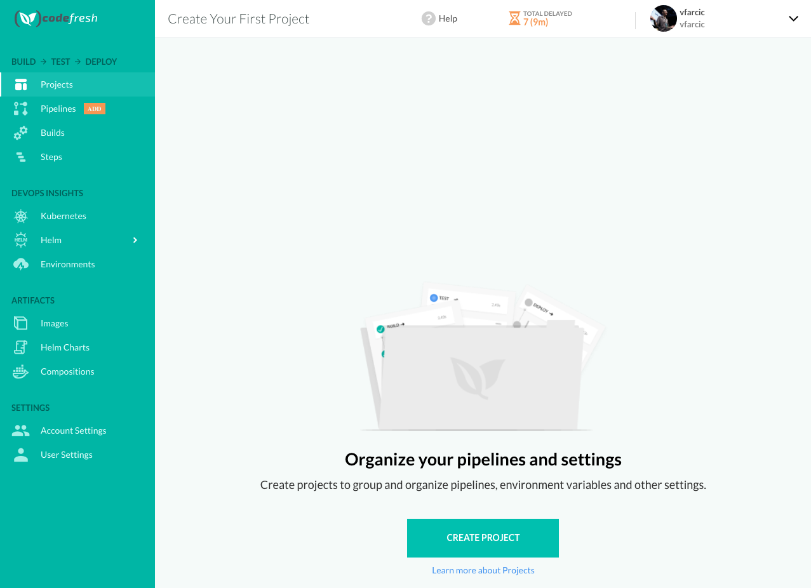
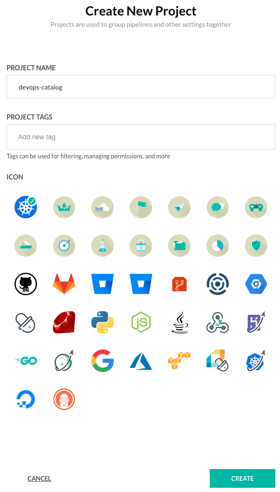
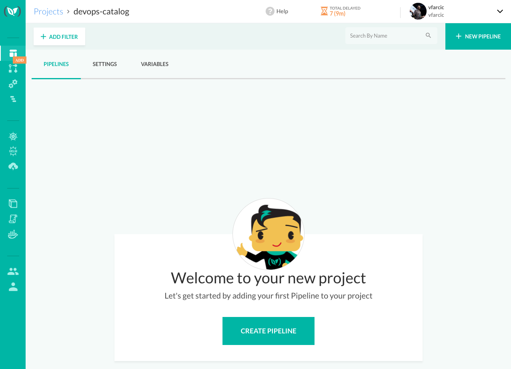
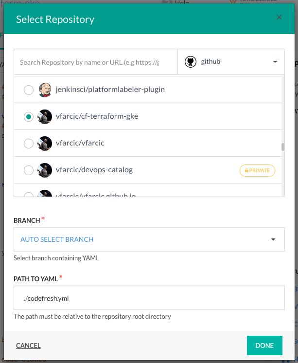
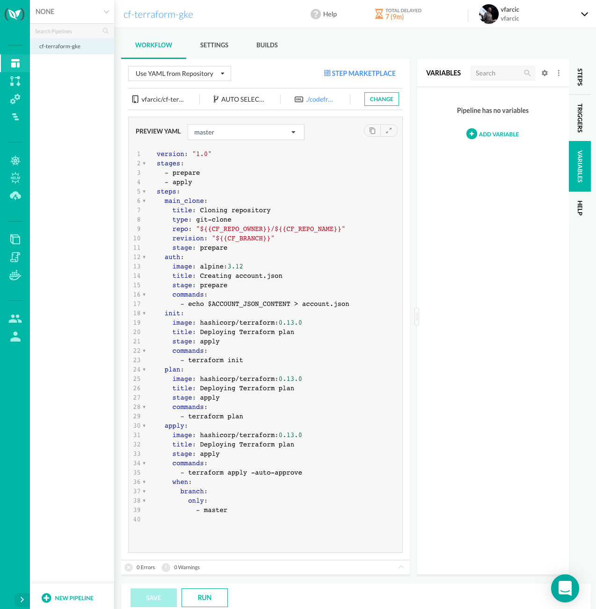
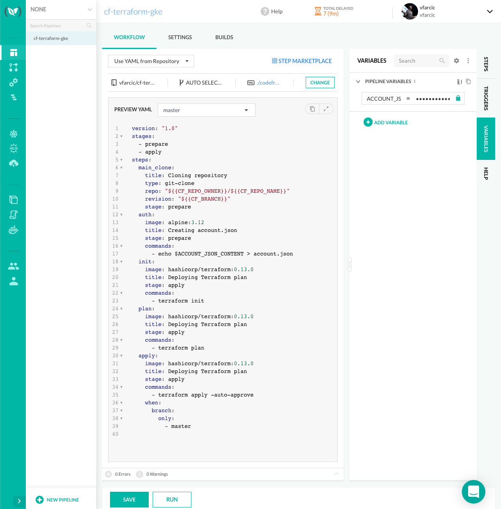
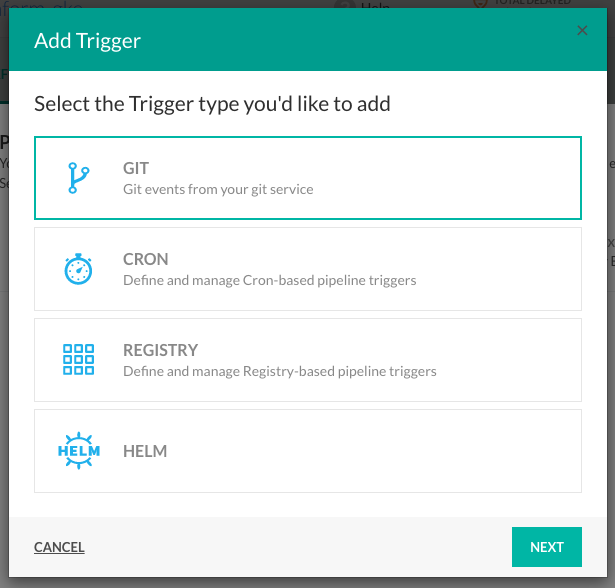
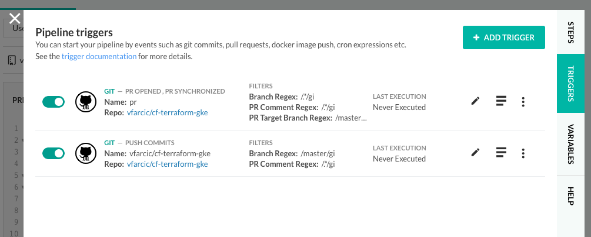
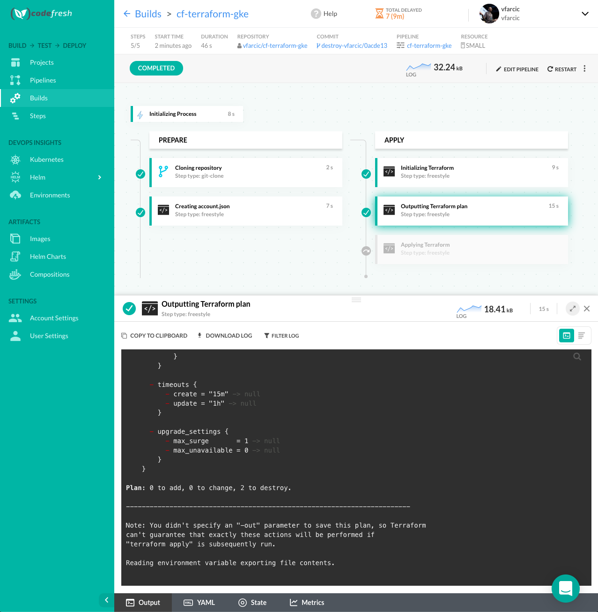

# Google Cloud Kubernetes Engine (GKE) Cluster With Terraform And CodeFresh

## Pre-Work

* Infrastructure as Code, GitOps, CI/CD

## Preparing

```bash
# TODO: Test in WSL

open https://github.com/vfarcic/cf-terraform-gke

# Fork it

export GH_USER=[...]

git clone https://github.com/$GH_USER/cf-terraform-gke

cd cf-terraform-gke

cp orig/*.tf .

gcloud auth login

export PROJECT_ID=doc-$(date +%Y%m%d%H%M%S) # e.g., doc-cf-project

gcloud projects create $PROJECT_ID

gcloud iam service-accounts \
    create devops-catalog \
    --project $PROJECT_ID \
    --display-name devops-catalog

gcloud iam service-accounts \
    keys create account.json \
    --iam-account devops-catalog@$PROJECT_ID.iam.gserviceaccount.com \
    --project $PROJECT_ID

gcloud projects \
    add-iam-policy-binding $PROJECT_ID \
    --member serviceAccount:devops-catalog@$PROJECT_ID.iam.gserviceaccount.com \
    --role roles/owner

open https://console.cloud.google.com/billing/linkedaccount?project=$PROJECT_ID

# Link a billing account

export BUCKET_NAME=doc-$(date +%Y%m%d%H%M%S) # e.g., doc-cf-bucket

export REGION=us-east1

gsutil mb \
    -p $PROJECT_ID \
    -l $REGION \
    -c "NEARLINE" \
    gs://$BUCKET_NAME

cat variables.tf

gcloud container get-server-config \
    --project $PROJECT_ID \
    --region $REGION

# Select one of `validMasterVersions` values.
# Select any version except the newest

export VERSION=[...]

cat variables.tf \
    | sed -e "s@CHANGE_PROJECT_ID@$PROJECT_ID@g" \
    | sed -e "s@CHANGE_VERSION@$VERSION@g" \
    | tee variables.tf

cat main.tf

cat main.tf \
    | sed -e "s@CHANGE_BUCKET@$BUCKET_NAME@g" \
    | tee main.tf

cat output.tf

git add .

git commit -m "Initial commit"

git push
```

## Managing GKE With CodeFresh

```bash
cat codefresh.yml
```

```yaml
version: "1.0"
stages:
  - prepare
  - apply
steps:
  main_clone:
    title: Cloning repository
    type: git-clone
    repo: "${{CF_REPO_OWNER}}/${{CF_REPO_NAME}}"
    revision: "${{CF_BRANCH}}"
    stage: prepare
  auth:
    image: alpine:3.12
    title: Creating account.json
    stage: prepare
    commands:
      - echo $ACCOUNT_JSON_CONTENT > account.json
  init:
    image: hashicorp/terraform:0.13.0
    title: Initializing Terraform
    stage: apply
    commands:
      - terraform init
  plan:
    image: hashicorp/terraform:0.13.0
    title: Outputting Terraform plan
    stage: apply
    commands:
      - terraform plan
  apply:
    image: hashicorp/terraform:0.13.0
    title: Applying Terraform
    stage: apply
    commands:
      - terraform apply -auto-approve 
    when:
      branch:
        only:
          - master
```

```bash
open https://codefresh.io/
```



```bash
# Click the *CREATE PROJECT* button if you're a the first time user, or *+ NEW PROJECT* if this is not the first one.

# Type *devops-catalog* as the *PROJECT NAME*
# Type any *PROJECT TAGS* and select any *ICON*
```



```bash
# Click the *CREATE* button
```



```bash
# Click the *CREATE PIPELINE* button

# Type *cf-terraform-gke* as the *pipeline name*
# Select *cf-terraform-gke*  as the repository
```


```bash
# Click the *CREATE* button

# Change *Inline YAML* to *Use YAML from Repository*
```



```bash
# Click the *DONE* button

cat account.json

# Copy the output

# Click the *VARIABLES* tab
```



```bash
# Click the *ADD VARIABLE* button
# Type *ACCOUNT_JSON_CONTENT* as the *Key* and paste the JSON into the *Value* field
# Click the *Encrypt* button, followed with *OK* to confirm the desire to *ENCRYPT VALUE*.
```



```bash
# Click the *SAVE* button

# Click the *RUN* button

# Select any of the steps to observe or follow the logs
```


```bash
terraform init
```

```
Initializing the backend...

Successfully configured the backend "gcs"! Terraform will automatically
use this backend unless the backend configuration changes.

Initializing provider plugins...
- Finding latest version of hashicorp/google...
- Installing hashicorp/google v3.36.0...
- Installed hashicorp/google v3.36.0 (signed by HashiCorp)

The following providers do not have any version constraints in configuration,
so the latest version was installed.

To prevent automatic upgrades to new major versions that may contain breaking
changes, we recommend adding version constraints in a required_providers block
in your configuration, with the constraint strings suggested below.

* hashicorp/google: version = "~> 3.36.0"

Terraform has been successfully initialized!

You may now begin working with Terraform. Try running "terraform plan" to see
any changes that are required for your infrastructure. All Terraform commands
should now work.

If you ever set or change modules or backend configuration for Terraform,
rerun this command to reinitialize your working directory. If you forget, other
commands will detect it and remind you to do so if necessary.
```

```bash
terraform refresh
```

```
google_project_service.cloud: Refreshing state... [id=doc-cf-project/cloudresourcemanager.googleapis.com]
google_project_service.container: Refreshing state... [id=doc-cf-project/container.googleapis.com]
google_container_cluster.primary[0]: Refreshing state... [id=projects/doc-cf-project/locations/us-east1/clusters/devops-catalog]
google_container_node_pool.primary_nodes[0]: Refreshing state... [id=projects/doc-cf-project/locations/us-east1/clusters/devops-catalog/nodePools/devops-catalog]

Outputs:

cluster_name = devops-catalog
project_id = doc-cf-project
region = us-east1
```

```bash
gcloud container clusters \
    get-credentials \
    $(terraform output cluster_name) \
    --project \
    $(terraform output project_id) \
    --region \
    $(terraform output region)

export KUBECONFIG=$PWD/kubeconfig

kubectl get nodes

# Click the *cf-terraform-gke* link from breadcrumbs in to top part of the screen

# Click the *TRIGGERS* tab

# Click the edit button of the only trigger
# Change *BRANCH (REGEX EXPRESSION)* to */master/gi*
# Click the *UPDATE* button

# Click the *ADD TRIGGER* button

# Click the *+ ADD TRIGGER* button

# Select *GIT* as the type
```



```bash
# Click the *NEXT* button

# Change the *TRIGGER NAME* to *pr*
# Select the *cf-terraform-gke* repo
# Unselect the *TRIGGER BY* option *Push commits*
# Select the *TRIGGER BY* option *Pull request opened*
# Select the *TRIGGER BY* option *Pull request synchronized*
# Change *PULL REQUEST TARGET BRANCH (REGEX EXPRESSION)* to */master/gi*
```


```bash
# Click the *NEXT* button

# Click the *DONE* button
```



```bash
# Click the *X* button to close the dialog

git checkout -b destroy

# Open *variables.tf* in your favorite editor
# Modify the value of the *destroy* variable to *true* and save the changes

git add .

git commit -m "Destroying everything"

git push \
    --set-upstream origin destroy
    
# Observe that a pipeline was NOT triggered

open https://github.com/$GH_USER/cf-terraform-gke

# Create a PR

# Observe that the pipeline was triggered

# Observe that the output of the *Outputting Terraform plan* step

# Observe that the *Applying Terraform* step was skipped
```



```bash
# Merge the PR to the master

git checkout master

# Observe that the pipeline was triggered

# Go to Google Cloud Console to confirm that the cluster is gone
```

## Destroy

```bash
gcloud projects delete $PROJECT_ID
```

## Next

### ChatOps

* Report the output of `terraform plan` back to the PR
* Assign a PR for review
* Merge to master through comments